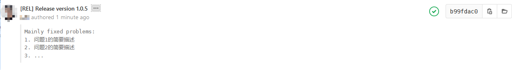

# GIT提交规范

在日常开发功能或者Debug的过程中, 请使用少量多次的方式来提交代码, 请保证每个提交仅包含一个独立的功能点,
该功能点指向Redmine中的某个单独的, 具体的问题.  
并且该过程中修改的代码也应该限制在一个模块内, 如果开发新功能时无法避免这种情况则考虑将该功能拆分到单独的模块.    
当你完成了某一功能点的开发或修复, 并通过了代码审核, 可以提交一次功能测试或验收时.  

1. 配置GIT
2. Commit消息规范
    

---

## 配置GIT(重要)  
为了保证每一次提交都能追溯到作者和联系方式.
请在在本地中设置好你的用户名和邮箱, 邮箱需要与你的`gitlab`账号使用的邮箱相同.
例如:  
```
git config --global user.name "odoo"
git config --global user.email "odoo@xiongdi.cn"

```

## Commit消息规范  

提交消息包括四个部分：标签 问题，模块和简短描述。  
> 注: 提交信息中所有符号均为半角符号  
>     模块名+冒号之后必须有且仅有一个空格  
>     模块名为你当次提交修改的主要模块. 涉及整体变更时, 模块名使用`项目名`  
>     简短描述必须为英文, 且首字母必须大写, 结尾不能有句点, 长度不超过50个字符  
```
模板: [标签名] #问题号 模块名/功能名: 简短描述你的更改
[IMP] #117 contact_extend: Fields description does not meet requirements

# 上述提交消息意义为: 针对#117这个问题, 做了一个FIX类型的提交, 主要工作是修改了联系人模块中的一些错误描述.

```

### 1. 标签  

在日常进行功能开发时都应该属于增量改进, 可以是用"[IMP]"类型, 对于修复出现的BUG可以使用"[FIX]"类型, 这是两种最常用的的提交类型.  


- [IMP] (常用) Improve, 改进. 开发版本中所做的大多数更改都是增量改进.
- [MERGE] (常用) Merge, 合并. 当一个周期的所有问题完成后, 请使用改标签进行提交. 使用该标签提交后, 将在Gitlab中创建相应分支的Merge Request.
- [FIX] (常用) Fix, 漏洞修复 主要用于稳定版本，也可用于要修复开发版本中的最新漏洞.
- [REL] Release, 发布：新的主要或次要稳定版本.

- [ADD] Add, 用于添加新模块.
- [MOV] Move, 移动文件：使用`git mv`命令且不要更改已移动文件的内容，
否则Git可能会丢失文件的跟踪和历史记录, 包括重命名!
- [REF] Refactoring, 用于重构, 功能被大量重写.
- [I18N] I18N, 修改翻译文件.
- [STYLE] 对代码风格等, 不影响代码含义的更改(空格、格式、缺少分号等).   
- [REM] Remove, 删除资源：删除无效代码，删除视图，删除模块.
- [REV] Restore, 还原提交：如果提交引起问题或不希望还原，则使用此标记完成.  


#### 特殊标签
##### [REL]

在填写发布提交的Commit信息时, 可以使用 -e 选项来启用编辑器, 进而方便换行和格式化等操作.  
在Commit消息中你的首次换行后的内容会被折叠, 因此我们可以通过换行来折叠具体的修改内容, 并突出变更的版本号.  


例如:
```
git -e -m "balabala"


[REL] Release version 1.0.5 \换行
Mainly fixed problems or new functions:
1. 问题/功能1的简要描述
2. 问题/功能2的简要描述
3. ...

```

  


##### [MERGE]

`[MERGE]`标签为一个特殊的标签, 他将自动创建Merge Request. [需要CI/CD工作流配合]  
当你的代码满足了一次合并到公共分支的要求时, 你就可以使用该参数为你的分支触发Merge阶段, 来推动代码审核, 代码合并工作.  

由于Merge标签的特殊性, 因此两个Merge标签之间应该是一个完整的功能, 所以你在推送该标签时, 
应该注意手动进行rebase等合并工作, 防止你的一个完整的功能中穿插了其他人的提交, 破坏提交历史的可读性.  

### 2. 问题编号
问题编号为该次提交相关的禅道问题编号, 以`#`符号开始, 以空格结束.  
> 注: 可通过gitlab集成的插件功能将问题编号链接到 redmine


### 3. 模块/功能 

- Odoo 开发中:  
每一次的针对开发提交中, 请尽量包含此次修改涉及到的模块名, 模块名主要为我们在开发中的所有扩展模块.  
一次提交修改的代码请保持在一个模块内, 避免出现一次提交, 出现大量模块被修改.  
当模块之间耦合度过高时, 修改某一功能就会无法避免的导致多个模块被改动, 所以在开发时需要考虑耦合度问题.  
如果是在修复历史BUG中遇到这种情况时, 则只列出与修改内容相关度最高或者修改内容最多的模块名.  

- 其他项目开发:  
其他项目开发中可能没有模块的概念, 则考虑使用简短的功能名替代.  

### 4. 简短描述  

简短描述主要说明你为什么进行了这些修改, 描述长度需要尽量限制在60个字符左右.  

比如某次测试反馈中说价格字段不应该是一个默认`0.00`的浮点数.  
你的提交消息就应该是'价格字段类型不符合某某需求', 而不是'修改了价格字段类型为货币类型`.  
因为在代码中我们能清晰地了解到你做了什么修改, 这是不需要重复描述的.  

假设一下为修改内容:  
```
# price_total = fields.Float()
price_total = fields.Monetary()

```


## 参考文献  
- [[1] Odoo-Guidelines官方文档](https://www.odoo.com/documentation/12.0/reference/guidelines.html#git)   
- [[2] Angular开源仓库开发者手册](https://github.com/angular/angular.js/blob/master/DEVELOPERS.md#type)  


## 以下内容已废弃
---
### 触发参数  

触发参数将会影响我们的持续集成与部署流程, Redmine问题关联和代码审核.  
我们期待每一次开发相关的提交都要关联且仅关联到一个问题上, 否则就是一个无意义不规范的提交.   

了解触发参数前先简要介绍持续部署的流程.  
主要流程包括以下五步:  
`Sonar 代码扫描 --> 构建Docker镜像 --> 模块安装测试 --> 部署到服务器 --> 创建合并请求`  
其中Sonar代码扫描为必须经过的流程.  
后续的三个流程将在以下三种情况时触发:  
1. 提交消息中包含了问题编号, 且没有使用`-s`参数.
2. 提交消息中包含了`#build`参数. 
3. 提交中包含了一个TAG. 

所以当你的提交不需要进行这些流程时, 你可以在问题编号后加上`-s`来跳过这些流程.  
另外当你的提交不关联到问题, 而又需要触发部署时, 你可以使用`#build`参数来触发构建参数.  
关于TAG则是在发布各类版本时用到的触发参数, 所以不能在个人分支上打TAG. 更多详细TAG的详细内容可参考[Git 的标签规范](./gitTagStandard.md)  

触发参数的可选值为: 问题编号, 触发部署流程的参数, 工时登记参数.  


例如:  

```
// '#'指定了问题编号为117, '@'表示登记的工时, '-s'表示跳过持续部署流程(单位`h`表示小时). 
[FIX] #117 @3h -s contact_extend: Fixed wrong description. 


// 这是一次不绑定问题的提交将触发持续部署的整个流程.
[FIX] #build contact_extend: Fixed some problems.  

// 针对这个问题117, 展开一次持续测试部署流程.  
[FIX] #117 @3h contact_extend: Fixed bugs about something. 
```  

> ***注:*** 触发参数可通过以下方式触发多个问题并登记工时, 但这是不被推荐的, 请尽量将你的提交拆分为更具体的子提交, 来关联到不同问题.  

```
// 同时关联到#117, #234, #256 为他们分别登记1小时工时, 并跳过部署测试过程.  
[FIX] #117 @1h #234 @1h #256 @1h -s module_name: something here. 
```

---

