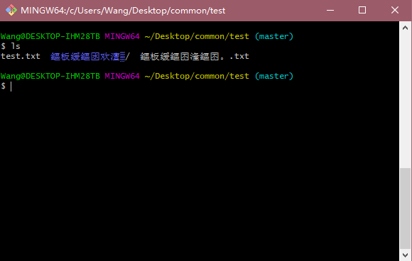
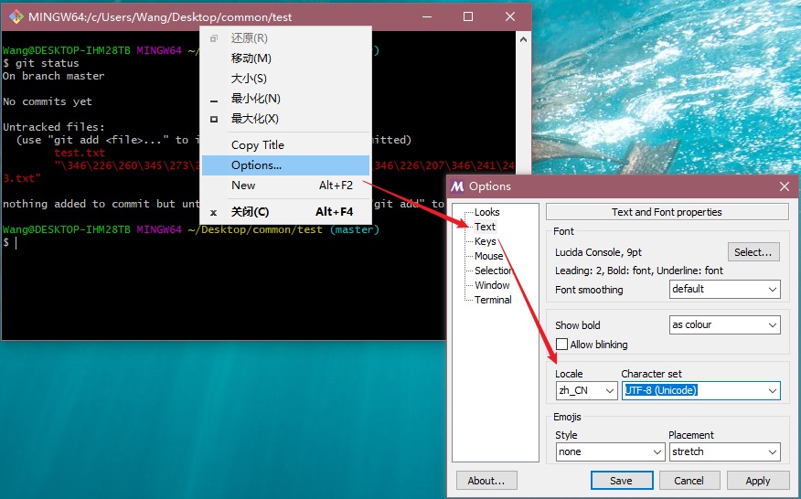
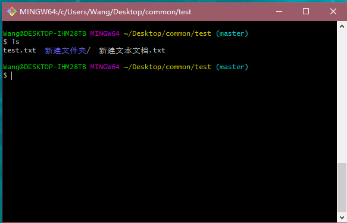
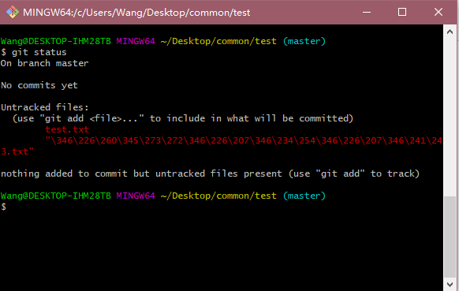
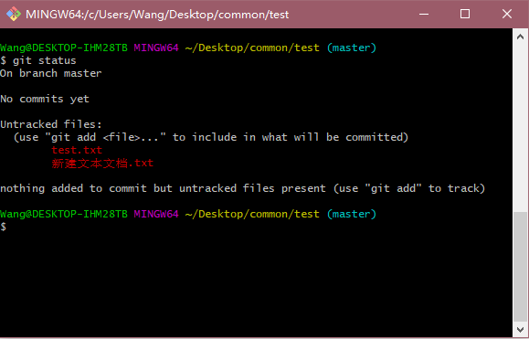

# 安装和配置 Git（Windows）

首先下载并安装[git for windows](https://github.com/git-for-windows/git/releases/download/v2.28.0.windows.1/Git-2.28.0-64-bit.exe)  
Git作为我们开发中不可或缺的版本控制工具, 但是在切换到新的环境后, 我们需要重新对其进行配置.  
主要包括以下几项:  
1. 配置用户名和邮箱
2. 配置默认的换行方式
3. 配置中文编码方式


---
## 1. 配置用户名与邮箱  

切换到新的环境中使用Git时需要重新配置用户名与邮箱,  
用户名与邮箱请与Gitlab上对应的用户名与邮箱.  
```
git config --global user.name "name"
git config --global user.email "email"
```


## 2. 换行  

换行分为 CRLF, CR, LF三种方式  
- LF: Line-Feed的缩写，即\n. Unix, Linux, macOS的默认换行方式.
- CR: Carriage-Return的缩写，即\r. Macintosh(老版macOS)的默认换行方式.
- CRLF: Carriage-Return Line-Feed的缩写，即\r\n. Windows的默认换行方式.  

Git提供了一个"换行符自动转换"功能. 这个功能默认处于自动模式, 当你在签出文件时, 
它试图将 UNIX 换行符(LF)替换为 Windows 的换行符(CRLF); 当你在提交文件时, 它又试图将 CRLF 替换为 LF.  
而我们希望统一使用`LF`方式, 而不希望他对换行符进行更改.  
因此我们需要使用下面的命令在GIT中关闭该功能: `git config --global core.autocrlf false`.  
  
并在Pycharm中将默认换行方式设置为`File > Settings > Code Style > Line Separator > Unix and macOS (\n)`, 配置文件中已经设置好.  

## 3. 中文编码  

`git for windows`的终端中文字符默认使用的是GBK码, 而系统等使用的UTF-8编码, 因此会导致输出显示中文时乱码, 或者在`git bash`中输入中文后无法彻底删除, 导致命令无法执行.   
出现类似下图中的情况:  


我们可以通过在`GIT BASH`窗口中打开右键菜单`Options > Text`, 将Locale设置为中文`zh_CN`, Character设置为`UTF-8`,  
  
然后编辑`<git_install_path>/etc/bash.bashrc`文件, 在末尾添加以下几行.  
```shell script
export LANG="en_US.UTF-8"
export LC_ALL="en_US.UTF-8"
alias ls='ls --show-control-chars --color=auto'
```
配置完成后:  
  
完成上述修改后, 在Git bash的命令台中已经能显示中文, 但是当使用 `git status` 等命令来查看跟踪的中文文件时, 仍会存在乱码.  
解决方案: `git config --global core.quotepath false`  

实际情形如下图:  

- 未配置前:  
  

- 配置后:  
     

