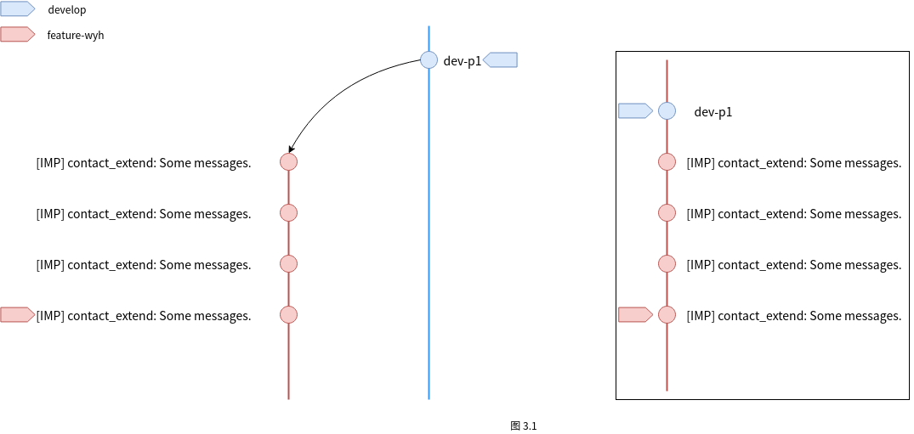
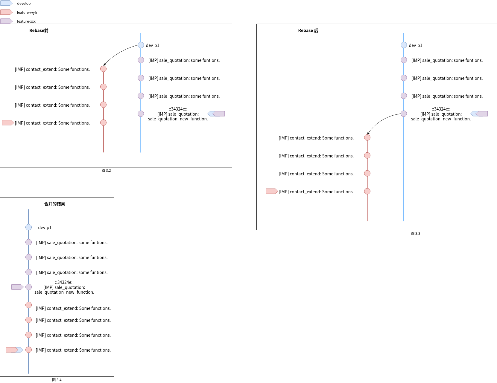
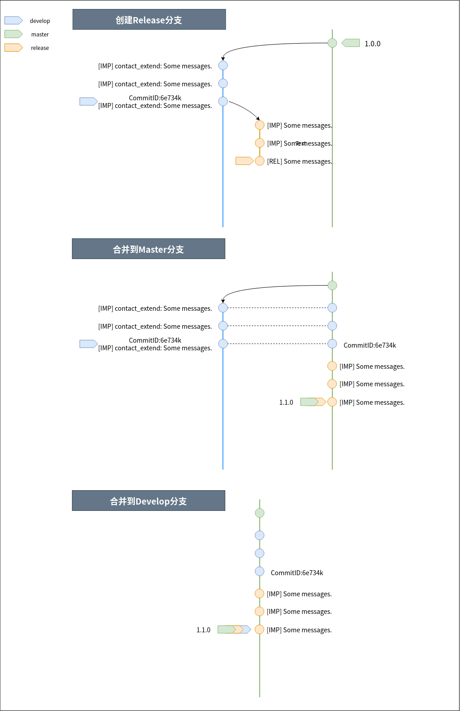
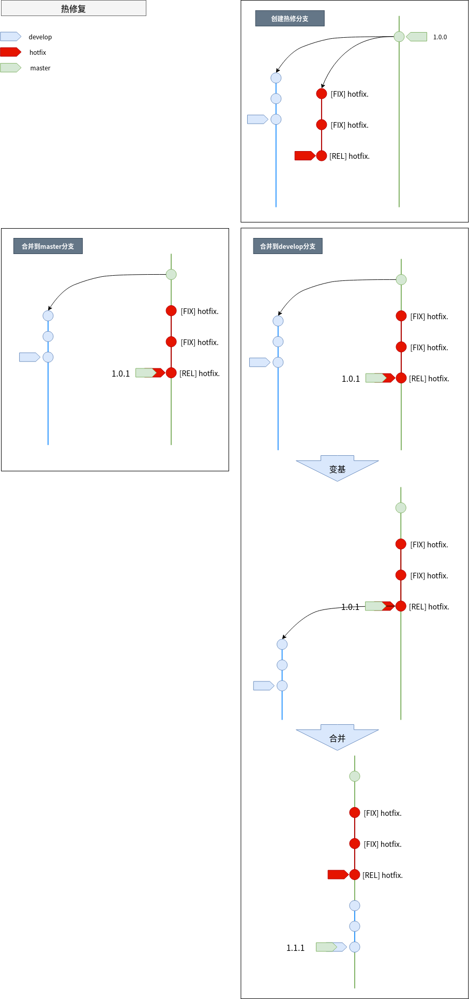

# 线性工作流介绍  

1. 工作流介绍
2. 测试流程
3. 分支介绍
4. 分支操作演示


---  
## 下面介绍我们日常工作时的工作流:   

__需求与设计:__  
当任务开始时, 我们会被分配到某个具体的任务或需求, 我们需要对这个需求进行分析, 确定不明确的地方, 考虑自己的设计思路.  
当有了自己设计思路后, 可以于其他开发者讨论自己的设计思路, 来确定该思路是否正确, 或者发现更好的设计思路.  
当确定了设计思路后, 我们可以将该需求分解成为尽可能小的独立的功能点, 将其记录为需求清单.  
有了需求清单后就可以着手进行开发了, 我们大部分的日常开发都是在个人分支上完成.  

__开始开发:__  
所以首先应该从开发分支的最新提交上建立自己个人分支(并不一定每一次开发都新建个人分支), 然后在个人分支上进行我们的开发工作.   
每完成一个功能点的开发时, 我们就应该向自己的本地分支进行一次提交, 这个提交需要经过单元测试, 保证这是一个完整且可运行的功能.   
在每一天的工作结束之前的一段时间内, 请对你的提交消息进行一次整理, 并将你的提交都关联到禅道上的问题, 更新其进度或流程.   
个人开发分支上允许一些临时的提交信息存在, 但在发布到开发分支前请务必将其整理好.  

__发布我们的代码:__   
当完成了该部分工作后, 我们就可以与其他开发者进行一次交付, 来确定我们的开发是否满足了当初的设计思路和需求.   
当确定设计满足了需求后, 我们可能需要将我们个人分支上的代码发布到开发分支上.  
在这之前我们需要将自己的个人分支变基到开发分支的最新提交上, 并解决变基过程中产生的所有冲突.  
产生代码冲突后, 记得与冲突代码的作者进行交流, 来明确为什么你们会修改同一处代码? 哪方的代码可以作为最终结果, 或者需要兼容双方的修改.  
等解决完这些冲突, 变基结束后, 整理我们的代码提交记录和具体的开发代码, 保证没有多余的提交记录和测试代码.  
然后还需要通过集成测试, 保证我们的新代码在变基后仍能正常运作, 并不会影响其他功能的正常运行.  
完成这几步后, 我们就可以提交以代码审核的请求, 只有通过了代码审核我们才能将个人分支上的代码合并到本地开发分支, 
最后将其推送到远程仓库的开发分支, 完成这一部分开发的整个流程.  

__发布新的代码版本:__  
随着开发的进行, 开发分支上逐渐积累了许多的新功能, 此时我们可能需要发布一个新的版本来放出这些新功能.  
那么如何进行一个新版本的发布呢?  
首先我们需要切换到开发分支某个具体的提交上, 并从该提交签出一个发布分支.  
该发布分支上就包含了我们想要发布的所有新功能.  
但在发布前我们还需要进行一次系统测试, 来保证新的功能点能正常稳定的与其他模块协调工作.  
如果在系统测试过程中出现了发现了问题, 下面是两种可能的解决方式:  
* 在一个人即可独立解决的情况下, 可直接在发布分支上进行开发.
* 如果需要多人合作时, 则应该在发布分支上签出每位开发者的个人发布分支, 并完成开发后合并到一起.   

如果在测试过程中我们对代码进行了修改, 那么我们还需要一次额外的测试(回归测试), 来保证新的改动没有引起新的错误.  
现在我们应该完成了我们测试, 并准备好真正的发布这个新版本了.   
我们就可以将这些功能发布到生产分支了, 并为这一次发布添加一个版本号:
如果此次发布的是大型完整的更新时, 版本号增加1.0.0; 如果只是发布某些新功能点, 则版本号增加0.1.0;  
如果测试中修改了代码, 产生了新的提交, 那么我们还需要将这些提交合并到开发分支以保留这些修改记录.  

__生产环境中错误的修复:__  
当生产分支的在代码在使用过程中发现了某些十分严重, 影响系统运行的恶性错误时, 我们需对其进行紧急的修复.   
这时, 我们就需要创建一个热修分支, 然后在这个分支上进行错误修复.   
当修复这些错误需要多人合作进行时, 应在热修分支的基础上签出新的个人热修分支, 并命名为 hotfix-<USER_NAME>.  
完成了修复之后我们需要进行一次回归测试保证既解决了原来的错误, 也没有产生新的错误.  
先在我们就可以将修复发布到生产分支中去了, 并为这次修复添加一个新的版本号, 递增0.0.1 .  
最后还需要将这些修复合并到开发分支中去, 以保留修改记录.  

---

## 测试流程  
__单元测试:__  
单元测试的主要目的是保证你的当前功能点能正常的运作. 所以它应该在你完成了一个功能点的开发之后, 提交到本地个人开发分支之前来进行.  

__集成测试:__  
集成测试的目的是保证你的所有功能点能与现在其他的模块或功能正确的协调运作, 避免影响其他模块的运行.   
集成测试应该在你将你的本地个人开发分支合并到本地公共开发分支之后, 将本地公共开发分支推送到远程公共开发分支之前.  

__系统测试:__   
系统测试的目的是保证整个系统能正确稳定的运行.   
该测试应该发生在热修分支或发布分支合并到生产分支之前.  

__回归测试:__  
回归测试是为了保证你在修复错误时改动的代码, 没有引起新的错误, 因此回归测试应该发生在热修分支或发布分支上修改了任意代码之后.

## 分支介绍

该分支模型将分支分为生产分支, 开发分支, 个人分支, 发布分支和热修分支.  
在代码库长久存在的只有生产分支. 其他分支则有可能被删除或重新创建.  


对于每个分支都要求的测试, 以保证正常的工作流程.  
1. 个人分支的每一次整理后的提交, 都要进行单元测试, 保证针对这个提交相关的功能能正常运行, 使得开发分支回滚到任意一个提交都能正常运行.
2. 在个人分支变基到开发分支的最新节点后, 要求集成测试, 保证各模块之间能正常的协作运行, 不会导致其他模块产生错误.
3. 热修或发布分支在签出后, 要求进行一次完备的系统测试, 确保新版本能持续可靠的运行.
4. 在完成热修分支和发布分支上的错误修复后, 要求进行回归测试, 保证没有因为修复错误而产生的新错误.


### 生产分支/master分支  
生产分支旨在提供一个运行稳定, 功能完善的版本.
每一次生产分支的更新都要求经过系统测试, 保证没有没有影响用户使用的恶性错误.  
生产分支的更新有以下 __要求:__  
1. 生产分支应设为保护分支, 不允许删除, 只接受来自维护者的推送.  
2. 更新只能从发布分支或热修分支发布.  
3. 保持线性提交, 拒绝合并提交记录.  


### 开发分支/develop分支  
开发分支拥有最新的集成代码, 记录着所有分支上的每一次提交记录, 每一次提交记录都对应一次问题或功能.  

为了报证这些提交记录的直观与简洁, 提出以下 __要求:__  
1. 开发分支应设为保护分支, 只接受来自维护者和开发者的推送.    
2. 开发分支应保持线性提交, 拒绝合并的提交记录.  
3. 每次提交包含且只包含一个独立的功能点, 要经过单元测试和集成, 保证提交的代码可直接运行.


### 个人分支/feature分支  
为了不影响开发分支上的代码, 开发者需要从开发分支上签出个人分支, 日常开发等都在个人分支上进行.  

个人分支的要求和限制:
1. 个人分支允许被删除和强制推送.  
2. 该分支上的提交不做限制, 但在向开发分支合并时则需要整理提交记录. 因此个人分支应该尽可能地保证清晰的提交记录, 以减少后面合并时的工作量. 
3. 合并时进行集成测试, 防止影响其他模块运行.  

整理提交记录时, 合并无意义的提交记录(例如: 保存代码用的提交, 临时的提交), 每次提交应为一个尽可能小的, 独立的功能点或问题.


### 发布分支/release 分支  

当我们的开发进行到某个里程碑时, 我们可能需要这些新功能发布到生产分支上, 此时我们就需要创建一个发布分支.  
发布分支应从开发分支签出, 在发布分支上进行新版本发布的最后测试工作.   
如果测试过程中出现了发现了问题:  
* 在一个人即可独立解决的情况下, 可直接在发布分支上进行开发.
* 如果需要多人合作时, 则应该在发布分支上签出每位开发者的个人发布分支(命名规则为: release-<USER_NAME>; 例如: release-wyh), 完成开发后合并到一起.  

发布分支的要求或限制: 
1. 允许删除和强制推送, 完成修改后应该合并到生产分支和开发分支.  
2. 产生改动后需要进行回归测试, 防止新的问题产生.  
3. 合并到生产分支时, 要将所有提交合并成一个, 并为这一提交打上版本标签. (通常是增加0.1.0; 发布大型版本时增加1.0.0)
4. 合并到开发分支时, 要整理发布分支上的提交, 保留这次发布过程中的修改记录.


### 热修分支/hotfix 分支  

当生产分支的在代码在使用过程中发现了某些十分严重, 影响系统运行的恶性bug时, 我们需对其进行紧急的修复.   
这时, 我们就需要创建热修分支.  
当修复这些bug需要多人合作进行时, 应在热修分支的基础上签出新的个人热修分支, 并命名为 hotfix-<USER_NAME>.  

热修分支的要求或限制:  
1. 允许删除和强制推送, 完成修改后合并到生产分支和开发分支.  
2. 产生改动后需要进行回归测试, 防止新的问题产生. 
3. 合并到生产分支时, 要在最后一个提交中， 修改文件版本号并创建REL类型的提交， 并为这一提交打上版本标签(递增0.0.1).  
4. 合并到开发分支时, 要整理发布分支上的提交, 保留这次发布过程中的修改记录.

## 分支操作的演示  

### 1. 创建个人分支  
命名时需符合个人分支命名规范 __feature-$USER_NAME__  
例如: feature-wyh  

    ```
    # 更新本地开发分支, 如相关问题中提到的有两种更新方式
    # 更新方式一
    git checkout develop
    git pull origin develop
    # 更新方式二
    git fetch origin develop:develop        # 注:该命令无法在 develop分支上执行.
    
    # 从最新的develop签出个人分支
    git checkout develop
    git checkout -b feature-wyh
    ```

### 2. 进行开发  

在个人分支上完成手头的工作, 每一次提交的记录要求符合Git Commit规范.  
为了数据安全和便于审核代码, 开发过程每天请至少进行一次提交  

    ```
    ############################################
    # 开发功能或者debug, 请保证每个提交包含且只包含一个独立的功能点.
    ############################################
    git add .
    git commit -m "[IMP] contact_extend: Some messages."

    git add .
    git commit -m "[IMP] contact_extend: Some messages."

    git add .
    git commit -m "Save code."

    git add .
    git commit -m "[IMP] contact_extend: Some messages."

    git add .
    git commit -m "[IMP] contact_extend: Some messages."
    
    # 查看提交记录
    git log
    #------- 输出 -------
    commit b4rg4d6...347 
    Author:
    Date:
    [IMP] contact_extend: Some messages.
    commit 4b464d6...347 
    Author:
    Date:
    [IMP] contact_extend: Some messages.
    
    
    commit 4b123d6...347 
    Author:
    Date:
    Save code.

    
    commit 9daw223...347 
    Author:
    Date:
    [IMP] contact_extend: Some messages.
    commit 09sef33...347 
    Author:
    Date:
    [IMP] contact_extend: Some messages.
    #-------------------
    
    ############################################
    # 对于无意义的提交记录, 请将其删除或合并到与其相关的提交中.
    # 例如上面的的第三次提交 'Save code' 提交ID为4b123d.
    ############################################
    git rebase -i develop
    
    ------- 输出 --------
    pick 4b464d6 [IMP] contact_extend: Some messages.
    
    # pick 4b6546d Save code. 将 pick 修改为 s.
    s 4b6546d Save code.
    
    pick 9daw223 [IMP] contact_extend: Some messages.
    pick 09sef33 [IMP] contact_extend: Some messages.
    ---------------------
    # 保存退出
    
    
    git log
    
    #------- 输出 -------
    commit 12364d6...347 
    Author:
    Date:
    [IMP] contact_extend: Some messages.
    commit 4b464d6...347 
    Author:
    Date:
    [IMP] contact_extend: Some messages.
    
    
    # 此处的'Save code`那次提交就被合并到父提交了.
    
    
    commit 9daw223...347 
    Author:
    Date:
    [IMP] contact_extend: Some messages.
    commit 09sef33...347 
    Author:
    Date:
    [IMP] contact_extend: Some messages.

    #--------------------
    
    ```

  

[如图3.1](../img/create_personal_branch.png)
中我从 `develop` 分支的最新节点[dev-p1] 签出了我们的个人分支 `feature-wyh` , 并已经在个人分支上提交了四次经过整理的`commit`记录.  
此时在`feature-wyh`分支上的`commit`记录应该为图3.1中右侧所示包含五个`commit`记录, 并且基点为`dev-p1`.  
假设这四次`commit`记录, 已经完成了我们当前部分的开发, 即需要将该部分代码合并到`develop`分支. 

### 3. 提交合并请求  

以上我们已经创建了我们自己的开发分支, 并且完成了一次开发, 现在我们需要将我们的新功能合并到开发分支上.  
但在那之前, 我们还需对我们这次开发的内容变基到远程 develop 分支最新提交上以解决可能在合并时产生的冲突,  
最后还需要进行代码审核以及单元测试.  

    ```
    git fetch origin develop:develop
    git rebase develop                  # 如果你了解了 git pull --rebase 的用法, 也可用它代替.
    
    # 更新远程个人分支
    git push origin feature-wyh
    
    ```
  

 

首先需要先更新`develop`分支, 假设更新完成后develop分支的提交记录
[如图3.2](./img/rebase_personal_branch.png)所示.   
我们发现已经有人提交了多个记录在`develop`分支上, 在图中表现为四次紫色的针对`sale_quotation`模块的`[IMP]`类型的提交.  
为了将`feature-wyh`分支上的新功能合并到`develop`分支上, 我们需要将`feature-wyh`分支变基到`develop`分支上的最新提交节点`sale_quotation_new_fucntion`.  
即将`feature-wyh`的基点由`dev-p1`修改到`sale_quotation_new_fucntion`,   
而此时`develop`正指向`develop`分支上的最新提交`34324e::sale_quotation_new_function`, `34324e`为`sale_quotation_new_function`这次提交的`commit_id`.  
因此在变基时我们可以使用`git rebase develop`或者`git rebase 34324e`.  

在以上rebase的过程中, git会在最新节点`34324e`后应用你的每一次提交, 此处我的功能只有四个提交, 因此会应用四次提交.  
当我的某一次提交(红)与紫色的提交内容产生冲突时, git 就会停止rebase, 并抛出一个文件冲突的异常.
到此, 我们需要手动修复这些冲突, 修复完成后使用 'git add .' 来跟踪修复产生的变动.
大部分情况下,  git会使用类似于以下代码块的方式来标注冲突位置.
```

>>>>>>> HEAD
被他人修改的代码.
=======
你修改的代码.
<<<<<<< [IMP] contact_extend: ....

```
但也存在部分特殊情况:
a. 直接删除或重命名了代码文件, 该行为git会抛出冲突异常, 但无法找到冲突位置.  
解决此类冲突时较为复杂, 首先确定哪些文件被删除或重命名, 然后确定自己的修改是否涉及到这部分代码,  
    - 如果没有, 则手动对该部分文件进行删除或重命名即可解决这次冲突;  
    - 如果修改了该部分代码, 怎应该了解该部分文件为何被删除或重命名, 基于此修改你的代码.  

面对这些冲突, 我们需要找出多人修改同一个文件的原因, 并确定具体应用那一次提交的变动. __禁止修改或删除他人的代码!__   
修复完冲突后, 需要使用`git add`来跟踪修复产生的变动.  

只有在父提交应用成功无冲突或解决了冲突后才能继续使用`git rebase --continue`应用下一次提交.  
变基后`feature-wyh`分支的`commit`记录应该变为如图3.3所示.   
移动基点后解决了 feature-wyh 与 develop 的分歧, 现在我们可以使用快进式合并合并两个分支.  

此时我就完成了我的代码合并工作, 可以向远程分支`origin/feature-wyh`分支提交我的代码.   
但是在提交时, 由于我们的提交记录中多出了一些本不存在的`commit`记录, 即图中紫色的提交,  
因此无法推送. 但我们可以使用`--force 或 -f`标识来进行强制推送.  

推送到远程仓库以后, 还需要进行代码审核以及将代码合并到`develop`等操作.  
当`develop`分支合并了我们代码后, 它的`commit`记录应该如图3.4所示.  


### 4. 发布新功能  

在前文中我已经将feature-wyh分支合并到develop分支, 假设这些提交满足了我们发布新版本的条件,  
现在我们就可以从develop 分支上签出release分支, 在图4.1用黄色表示, 用于发布新的功能.  

> 注: 发布过程中, 不要对 develop 分支进行额外的修改.  

#### 发布新功能需要分以下步骤:
1. 从 develop 分支签出 release 分支
    ```shell script
    git fetch origin develop:develop
    git checkout develop
    git checkout -b release
    ```
2. 推送 release 分支, 部署 release 发布测试环境
    ```shell script
    git push origin release
    ```
3. 测试, 更新 release 分支, 和测试环境
    ```shell script
    git add .
    git commit -am "[REL] 最终发布提交"
    git push origin release
    ```
4. 合并到 develop  
合并 release 到 develop 之前, 应该避免对 develop 的更新,  
否则需要将更新提交 rebase 到 release 的提交之后
    ```shell script
    git fetch origin develop:develop
    git fetch origin release:release
    git branch -D develop
    git checkout develop
    git merge --ff origin release
    git push origin develop
    git push origin release
    ```
5. 合并到 master  
更新 master 之前需要将release分支变基到master分支上

    ```shell script
    # 更新远程分支
    git fetch origin master:master
    git fetch origin release:release
   
    # 切换到 release 分支, 并变基到 master 分支上
    git chekcout release
    git rebase master
   
    # 切换到 master 分支, 合并 release 分支
    git checkout master
    git merge --ff release
   
    # 推送更新到 master 分支
    git push origin master
    ```


  


### 5. 修复生产分支上的错误  

#### 从master创建hotfix, 热修分为以下步骤:
1. 从 master 签出 hotfix 分支
    ```shell script
    git fetch origin master:master
    git checkout origin master
    git checkout -b hotfix
    ```
2. 更新, 推送 hotfix 分支, 部署 hotfix 热修测试环境
    ```shell script
    git add .
    git commit -am "[FIX] 热修提交"
    git push origin hotfix
    ```
3. 合并到 master
    ``` shell script
    # 更新 master, hotfix 分支
    git fetch origin master:master
    git fetch origin hotfix:hotfix
    
    # 将热修分支变基到master分支
    git checkout hotfix
    git rebase origin master
   
    # 合并 hotfix 分支
    git checkout master
    git merge --ff hotfix
   
    # 更新 master 分支
    git push origin master
    ```

4. 更新到 develop
    > 注： 需要在更新master分支后进行

    ```shell script
    # 更新 master， develop 分支
    git fetch origin master:master
    git fetch origin develop:develop
   
    # 切换到 develop 分支， 并变基到 master 分支
    git checkout develop
    git rebase master
    
    # 由于变基的原因， 需要强制更新 develop 分支
    git push origin develop -f
    ```


  


--- 


